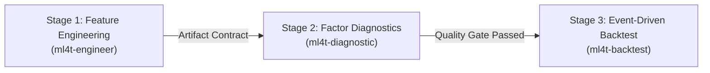

# Engineering and Agent Guidelines: Quantitative Research Suite

This document defines the architectural rules, quantitative methodology, coding standards, and verification requirements for autonomous agents and engineers contributing to this repository.

---

## 1. Executive Summary

This repository implements systematic alpha research, factor diagnostics, and event-driven backtesting. The architecture combines:
1. **Marimo Reactive Notebooks**: Reproducible, pure-Python (`.py`) notebooks modeled as Directed Acyclic Graphs (DAGs).
2. **Machine Learning for Algorithmic Trading (ML4T)**: Stage-gated research protocols preventing data leakage, lookahead bias, and multiple-testing overfitting.
3. **Polars & TA-Lib**: High-performance, vectorized data transformations with strict numerical parity against reference implementations.

---

## 2. Core Behavioral Invariants for Agents

All agents operating in this repository must adhere to three foundational rules:

### Rule 1: The 80/20 Implementation Split
Teach and implement core quantitative concepts using standard Python libraries (`polars`, `numpy`, `scipy`, `scikit-learn`). Use `ml4t-*` packages (`ml4t-engineer`, `ml4t-diagnostic`, `ml4t-backtest`) for production implementations.
* **Prohibition**: Never import `ml4t.*` inside foundational pattern definitions or unit tests designed to demonstrate first principles.

### Rule 2: Zero Lookahead & Survivorship Bias
Financial data must reflect only the information available at the decision timestamp ($t$).
* Never use full-dataset transformations (e.g., `StandardScaler.fit()` over entire series). Fit transformers exclusively on training windows and transform out-of-fold data.
* Never construct point-in-time datasets using backward-revised economic series or survivor-only equity universes.

### Rule 3: Mandatory Multiple-Testing Haircuts
Every tuned parameter, altered feature, or evaluated rule constitutes a statistical trial.
* Never report an optimized in-sample Sharpe ratio without adjusting for trial count.
* You must compute the **Deflated Sharpe Ratio (DSR)** and the **Bailey & López de Prado Haircut** whenever evaluating multiple variants.

---

## 3. The Three-Stage ML4T Pipeline

Every quantitative strategy must transition through three distinct, stage-gated phases:



### Stage 1: Feature Engineering & Labeling (`ml4t-engineer`)
* **Inputs**: Cleaned OHLCV Parquet files from `data/processed/`.
* **Transforms**: Compute technical, momentum, volatility, and fundamental features. Features must be group-aware when operating on asset panels.
* **Labeling**: Use path-dependent labeling (e.g., Triple Barrier Method with ATR volatility scaling) rather than fixed-horizon forward returns.
* **Storage**: Persist feature matrices to `data/features/` and target labels to `data/labels/`.

### Stage 2: Signal & Factor Diagnostics (`ml4t-diagnostic`)
* **Objective**: Evaluate whether a feature contains predictive information before running a full backtest.
* **Metrics**:
  * Cross-Sectional Information Coefficient (Spearman Rank IC).
  * Information Ratio ($IC\_IR = \text{mean}(IC) / \text{std}(IC)$).
  * IC Decay profile across forecast horizons ($H \in \{1, 4, 8, 16, 32\}$ bars).
  * Quantile monotonicity and turnover analysis.
* **Cross-Validation**: Use `WalkForwardCV` or `CombinatorialCV` with explicit embargo buffers to prevent label overlap leakage.

### Stage 3: Event-Driven Backtesting (`ml4t-backtest`)
* **Objective**: Simulate realistic order matching and portfolio performance.
* **Execution**: Strategies must implement `ml4t.backtest.Strategy` with explicit handlers (`on_data`, `on_start`, `on_end`).
* **Cost Modeling**: Always include explicit commission and slippage models. Default to at least **2 bps commission** and **1 bps slippage** per execution leg.
* **Sharpe Calculation**: Calculate Sharpe ratios on continuous daily portfolio equity returns. Never annualize intraday per-trade returns with trade frequency multipliers.

---

## 4. Quantitative Quality Gates

A strategy cannot proceed to backtest deployment unless it satisfies all criteria:

| Quality Gate | Metric | Minimum Acceptance Threshold | Corrective Action on Failure |
| :--- | :--- | :--- | :--- |
| **Signal Predictive Power** | Spearman Rank IC | $\ge 0.02$ with $p\text{-value} < 0.05$ | Reject feature; re-evaluate lookahead window or feature formulation. |
| **Multiple Testing Bias** | Deflated Sharpe Ratio (DSR) | $\ge 0.95$ (95% confidence) | Penalize for trial count; discard overfit parameter configurations. |
| **Overfitting Probability** | Probability of Backtest Overfitting (PBO) | $< 0.50$ via Combinatorial CV | Strategy winner is noise; simplify model and reduce parameter count. |
| **Parameter Stability** | Sensitivity Surface Plateau | $> 60\%$ of parameter neighborhood profitable | Reject knife-edge optimum; identify stable parameter regions. |
| **Transaction Survivability** | Net Return Post-Friction | Net positive after 2 bps fee + 1 bps slippage | Increase holding horizon or eliminate high-churn triggers. |

---

## 5. Marimo Reactive Notebook Invariants

Marimo notebooks are pure Python modules executed as a reactive Directed Acyclic Graph (DAG). Agents must enforce these mechanical constraints:

### 1. Global Variable Uniqueness
Each variable name can only be defined in a single cell. Defining the same global variable across multiple cells raises a runtime DAG compilation error.

### 2. Cell-Private Variable Scoping
Variables intended for local cell computation must be prefixed with an underscore (`_`).
```python
# CORRECT: Cell-scoped private variables do not pollute the global namespace
@app.cell
def compute_metrics(prices):
    _diff = prices.diff()
    _vol = _diff.std()
    feature_vol = _vol * 100  # Global variable exported to downstream cells
    return (feature_vol,)
```

### 3. Output Payload Budget
Marimo serializes visual outputs to the browser DOM. Rendering large objects crashes the client interface.
* **Limit**: Total output payload per cell must remain well below `10,000,000` bytes (10 MB).
* **Rule**: Never pass raw, high-frequency DataFrames ($> 1,000$ rows) directly into `mo.ui.table()` or unbinned Altair charts.
* **Pattern**: Aggregate or downsample time series to daily or hourly intervals before rendering visual components.

```python
# WRONG: Serializes 50,000 15m bars to JSON (causes DOM crash)
alt.Chart(df_15m).mark_line().encode(x="timestamp:T", y="equity:Q")

# CORRECT: Downsample to daily closing equity (< 2,000 points)
df_daily = df_15m.group_by_dynamic("timestamp", every="1d").agg(pl.col("equity").last())
alt.Chart(df_daily).mark_line().encode(x="timestamp:T", y="equity:Q")
```

### 4. Headless Validation
Validate notebook syntax and reactive dependencies from the command line before committing changes:
```bash
marimo check notebooks/quantified_strategies_engulfing.py
```

---

## 6. Repository Architecture & Directory Contracts

Agents must preserve the following directory taxonomy:

```text
.
├── config/
│   └── setup.yaml              # Single Source of Truth for universe, dates, costs, and gates
├── data/                       # Pipeline storage tiers (read/write access controlled)
│   ├── raw/                    # Read-only vendor market feeds (git-ignored)
│   ├── processed/              # Canonical Parquet datasets (git-ignored)
│   ├── features/               # Versioned factor matrices (git-ignored)
│   └── labels/                 # Path-dependent target labels (git-ignored)
├── notebooks/                  # Production-grade Marimo reactive notebooks (.py)
├── run_log/                    # Experiment tracking ledger, metrics, and audit logs
├── src/                        # Modular, reusable quantitative domain logic
│   ├── __init__.py
│   └── patterns.py             # Pattern recognition with TA-Lib numerical parity
├── tests/                      # Automated unit and integration test suites
│   ├── __init__.py
│   └── test_*.py               # Pytest verification suites
├── pyproject.toml              # Dependencies, marimo runtime options, and pytest settings
├── .gitignore                  # Exclusion rules for caches, virtual environments, and data
└── README.md                   # Project overview, empirical findings, and reproduction steps
```

---

## 7. Developer & Agent Verification Runbook

Before completing any task or pushing changes, execute this verification sequence:

### Step 1: Run Automated Test Suites
Verify algorithmic correctness and numerical parity:
```bash
uv run pytest
```
*Criteria*: All tests must pass with zero failures and zero warnings.

### Step 2: Validate Marimo Reactive DAGs
Verify that no notebook cells contain syntax warnings, invalid escape sequences, or cyclical variable bindings:
```bash
marimo check notebooks/quantified_strategies_engulfing.py
```
*Criteria*: Must output `0 warnings, 0 errors`.

### Step 3: Audit Git Workspace
Ensure transient caches and large data files are untracked:
```bash
git status
```
*Criteria*: No parquet files, database locks, or virtual environments (`.venv/`, `__pycache__/`) may appear in untracked files.

### Step 4: Synchronize Remote Workspaces
When deploying to remote container environments (e.g., Molab):
1. Replicate directory scaffolding (`config/`, `data/`, `src/`, `tests/`).
2. Run remote unit tests (`python3 -m pytest tests`).
3. Verify remote Marimo DAG execution (`marimo check notebook.py`).

---

## 8. Anti-Patterns & Prohibitions

1. **Do not use traditional Jupyter (`.ipynb`) files**: All notebooks must remain pure Python (`.py`) files with `@app.cell` decorators.
2. **Do not hardcode parameters**: Read symbols, dates, transaction costs, and thresholds from `config/setup.yaml`.
3. **Do not hide failed trials**: Document every tested strategy variation to maintain accurate trial counts for Deflated Sharpe Ratio calculation.
4. **Do not trade unhedged low-capacity signals**: Signals with high turnover ($> 2,000$ trades) on intraday bars must incorporate realistic market impact modeling.
