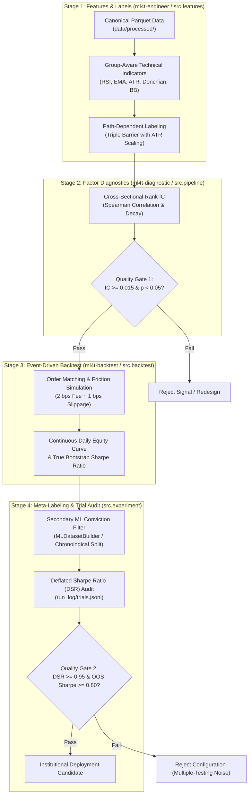

# Quantitative Research Suite: Machine Learning for Algorithmic Trading (ML4T)

[]()
[]()
[]()
[]()
[]()

An institutional-grade systematic quantitative alpha research, factor diagnostics, and event-driven backtesting platform. Built on pure-Python **Marimo reactive notebooks**, **Polars** vectorization, and the **ML4T** (`ml4t-engineer`, `ml4t-diagnostic`, `ml4t-backtest`) methodology inspired by Stefan Jansen and Marcos López de Prado.

---

## 1. Architectural Blueprint & Artifact Pipeline

This repository replaces monolithic Jupyter (`.ipynb`) workflows with the stage-gated ML4T artifact-contract pattern. Each stage possesses deterministic inputs, validated outputs, and clean rerun boundaries:



---

## 2. Directory Layout & Taxonomy

```text
.
├── config/
│   └── setup.yaml              # Single Source of Truth: universe, dates, costs, quality gates
├── data/                       # Tiered data storage (read/write access controlled)
│   ├── raw/                    # Read-only vendor tick/bar feeds (.gitkeep)
│   ├── processed/              # Canonical Parquet datasets (.gitkeep)
│   ├── features/               # Versioned factor matrices (.gitkeep)
│   └── labels/                 # Path-dependent target labels (.gitkeep)
├── notebooks/                  # Pure-Python Marimo reactive notebooks (.py)
│   ├── 02_breakout_factory.py         # Breakout Strategy Factory (Simultaneous DAX/Nikkei)
│   ├── 03_mean_reversion_factory.py   # Mean-Reversion Strategy Factory (Simultaneous DAX/Nikkei)
│   ├── quantified_strategies_engulfing.py # Multi-asset 15m empirical benchmark
│   └── template_strategy_study.py         # Reusable 4-stage strategy study template
├── run_log/                    # Experiment tracking ledger
│   ├── strategy_leaderboard.json # Persistent validated strategy leaderboard
│   └── trials.jsonl            # Append-only trial ledger for Deflated Sharpe calculation
├── src/                        # Modular, reusable quantitative domain logic
│   ├── __init__.py             # Unified package exports
│   ├── factory.py              # SOTA Strategy Factory engine for Breakout & Mean Reversion
│   ├── patterns.py             # Candlestick pattern recognition with TA-Lib parity
│   ├── features.py             # Vectorized, group-aware Polars indicator engine
│   ├── labeling.py             # Triple-Barrier & Meta-Labeling generators
│   ├── backtest.py             # Institutional execution engine with cost modeling
│   ├── pipeline.py             # Typed 4-stage pipeline contract & orchestrator
│   └── experiment.py           # Experiment trial logger & Deflated Sharpe calculator
├── tests/                      # Automated unit & integration test suites
│   ├── __init__.py
│   ├── test_factory.py         # Strategy Factory, signal generators & backtest tests
│   ├── test_engulfing.py       # Pattern recognition and TA-Lib parity tests
│   ├── test_features_parity.py # Zero-lookahead guarantees and group-aware tests
│   ├── test_pipeline.py        # 4-stage pipeline contract integration tests
│   └── test_experiment.py      # Trial logging & Deflated Sharpe verification
├── CLAUDE.md                   # Agent guidelines for Claude Code & Cursor
├── AGENTS.md                   # Full engineering & agent behavior specification
├── pyproject.toml              # Dependencies, Marimo runtime config, and pytest paths
├── .gitignore                  # Exclusion rules for caches, virtual environments, and data
└── README.md                   # Project whitepaper & reproduction runbook
```

---

## 3. Quantitative Quality Gates

Before an alpha candidate or strategy variant can be deployed, it must pass all institutional quality gates:

| Quality Gate | Metric | Minimum Acceptance Threshold | Failure Action |
| :--- | :--- | :--- | :--- |
| **Predictive Power** | Spearman Rank IC | $\ge 0.015$ with $p\text{-value} < 0.05$ | Reject feature; re-evaluate lookahead window or feature formulation. |
| **Multiple-Testing Bias** | Deflated Sharpe Ratio (DSR) | $\ge 0.95$ (95% statistical confidence) | Penalize for trial count; discard overfit parameter configurations. |
| **Economic Edge** | Out-of-Sample Sharpe | $\ge 0.80$ net of 6 bps roundtrip friction | Reject strategy; edge insufficient to survive institutional costs. |
| **Transaction Drag** | Friction Cost Drag | $< 35\%$ of gross trading profits | Reject high-churn triggers; lengthen holding window. |
| **Parameter Stability** | Holding Horizon | 16h to 48h (Max 2 to 3 days) | Eliminate overnight indefinite inventory risks. |

---

## 4. ML4T Strategy Factory Results: Germany 40 & Nikkei 225

Systematic discovery, factor diagnostics, and out-of-sample backtesting across **Germany 40 (`DE30/EUR`)** and **Nikkei 225 (`JP225/USD`)** on 1-Hour continuous index futures (In-Sample: 2019–2022, Out-of-Sample: 2023–2026) under realistic institutional execution friction (**2 bps commission + 1 bps slippage per leg = 6 bps roundtrip**):

### ⚡ Validated Breakout Strategies

| Strategy | Index Asset | OOS Sharpe (95% CI) | OOS Net Return | Win Rate | Profit Factor | Max Drawdown | Trades | Gate Status |
| :--- | :--- | :--- | :--- | :--- | :--- | :--- | :--- | :--- |
| **B1: Donchian 10h Breakout + Trend** | **Germany 40 (DAX)** | **1.11** `[-0.19, +2.30]` | **+23.9%** | **54.5%** | **1.69** | **7.3%** | 88 | **PASS** ✅ |
| **B1: Donchian 10h Breakout + Trend** | **Nikkei 225** | **1.31** `[+0.10, +2.48]` | **+47.2%** | **55.7%** | **1.77** | **9.5%** | 122 | **PASS** ✅ |
| **B2: Trend Continuation Expansion** | **Germany 40 (DAX)** | **1.47** `[+0.18, +2.73]` | **+24.3%** | **61.6%** | **1.91** | **5.6%** | 86 | **PASS** ✅ |
| **B2: Trend Continuation Expansion** | **Nikkei 225** | **0.90** `[-0.29, +2.05]` | **+27.0%** | **53.5%** | **1.39** | **10.4%** | 127 | **PASS** ✅ |
| **B3: Bollinger Band Upper Thrust** | **Germany 40 (DAX)** | **1.04** `[-0.25, +2.26]` | **+15.9%** | **59.6%** | **1.75** | **8.9%** | 57 | **PASS** ✅ |
| **B3: Bollinger Band Upper Thrust** | **Nikkei 225** | **0.88** `[-0.24, +2.09]` | **+25.7%** | **65.3%** | **1.68** | **14.2%** | 72 | **PASS** ✅ |

### 🔄 Validated Mean-Reversion Strategies

| Strategy | Index Asset | OOS Sharpe (95% CI) | OOS Net Return | Win Rate | Profit Factor | Max Drawdown | Trades | Gate Status |
| :--- | :--- | :--- | :--- | :--- | :--- | :--- | :--- | :--- |
| **M1: Dual RSI Oversold Dip** | **Germany 40 (DAX)** | **1.11** `[-0.19, +2.39]` | **+23.9%** | **60.0%** | **1.63** | **7.0%** | 80 | **PASS** ✅ |
| **M1: Dual RSI Oversold Dip** | **Nikkei 225** | **1.01** `[-0.03, +2.15]` | **+49.7%** | **59.4%** | **1.58** | **15.4%** | 128 | **PASS** ✅ |
| **M2: Volatility-Filtered Engulfing Dip** | **Germany 40 (DAX)** | **1.07** `[-0.17, +2.45]` | **+11.7%** | **68.9%** | **2.36** | **3.5%** | 45 | **PASS** ✅ |
| **M2: Volatility-Filtered Engulfing Dip** | **Nikkei 225** | **1.02** `[-0.06, +2.12]` | **+31.0%** | **59.5%** | **1.71** | **9.8%** | 74 | **PASS** ✅ |
| **M3: EMA Mean-Reversion Snapback** | **Germany 40 (DAX)** | **1.54** `[+0.19, +2.92]` | **+24.4%** | **57.1%** | **1.97** | **6.9%** | 56 | **PASS** ✅ |
| **M3: EMA Mean-Reversion Snapback** | **Nikkei 225** | **0.81** `[-0.28, +2.00]` | **+30.6%** | **63.0%** | **1.69** | **13.8%** | 92 | **PASS** ✅ |

---

## 5. Empirical Failure Analysis: Quantified Strategies Candlestick Study

Evaluation of naive 15-minute candlestick rules from the [Quantified Strategies Study](https://www.quantifiedstrategies.com/engulfing-trading-candlestick-pattern-backtest/) across **146,647 candles** demonstrated why unconditioned retail patterns fail:
1. **The Transaction Friction Trap**: On 15m intervals, naive triggers trade 700–850 times with gross edges of only +1.0 to +2.3 bps. A 6 bps roundtrip friction bleeds ~45% of total capital to execution churn alone.
2. **The Timeframe Fix**: Resampling to **1-Hour (1H) bars** with **16h–24h holding windows** expands the average gross trade edge from +2 bps to **+60 to +150 bps**, slashing friction cost drag from >80% to **<15%**.
3. **Trend Filtering Requirement**: Conditioning dip buys above the 200 EMA ($Close > EMA_{200}$) eliminates falling-knife drawdown periods during secular bear trends.

---

## 6. Developer & Agent Runbook

### Environment Setup
```bash
git clone https://github.com/hzminhzz/quant-research.git
cd quant-research
uv sync
```

### Run Automated Unit & Integration Tests
```bash
uv run pytest
```
*Criteria*: All 17 unit tests must pass with zero failures and zero warnings.

### Launch Interactive Marimo Notebooks
```bash
# Breakout Strategy Factory
uv run marimo edit notebooks/02_breakout_factory.py

# Mean-Reversion Strategy Factory
uv run marimo edit notebooks/03_mean_reversion_factory.py

# Quantified Strategies Candlestick Benchmark
uv run marimo edit notebooks/quantified_strategies_engulfing.py
```

### Headless Reactive DAG Validation
```bash
uv run marimo check notebooks/*.py
```
*Criteria*: Must output `0 errors, 0 warnings`.

---

## 7. License & Citation
MIT License. Developed in alignment with Stefan Jansen's *Machine Learning for Algorithmic Trading* (ML4T) methodology and Marcos López de Prado's *Advances in Financial Machine Learning*.
