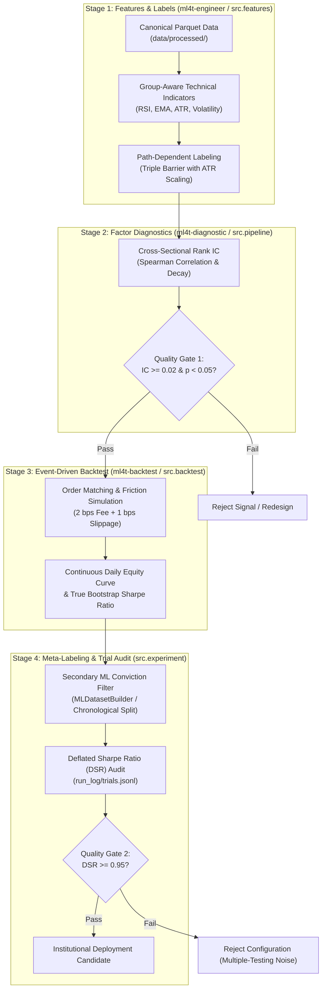

# Quantitative Research Suite: Machine Learning for Algorithmic Trading (ML4T)

[]()
[]()
[]()
[]()
[]()

An institutional-grade systematic quantitative alpha research, factor diagnostics, and event-driven backtesting platform. Built on pure-Python **Marimo reactive notebooks**, **Polars** vectorization, and the **ML4T** (`ml4t-engineer`, `ml4t-diagnostic`, `ml4t-backtest`) methodology inspired by Stefan Jansen and Marcos López de Prado.

---

## 1. Architectural Blueprint & Artifact Pipeline

This repository replaces monolithic Jupyter (`.ipynb`) workflows with the stage-gated ML4T artifact-contract pattern. Each stage possesses deterministic inputs, validated outputs, and clean rerun boundaries:



---

## 2. Directory Layout & Taxonomy

```text
.
├── config/
│   └── setup.yaml              # Single Source of Truth: universe, dates, costs, quality gates
├── data/                       # Tiered data storage (read/write access controlled)
│   ├── raw/                    # Read-only vendor tick/bar feeds (.gitkeep)
│   ├── processed/              # Canonical Parquet datasets (.gitkeep)
│   ├── features/               # Versioned factor matrices (.gitkeep)
│   └── labels/                 # Path-dependent target labels (.gitkeep)
├── notebooks/                  # Pure-Python Marimo reactive notebooks (.py)
│   ├── quantified_strategies_engulfing.py # Multi-asset 15m empirical benchmark (12 cells)
│   └── template_strategy_study.py         # Reusable 4-stage strategy study template
├── run_log/                    # Experiment tracking ledger
│   └── trials.jsonl            # Append-only trial ledger for Deflated Sharpe calculation
├── src/                        # Modular, reusable quantitative domain logic
│   ├── __init__.py             # Unified package exports
│   ├── patterns.py             # Candlestick pattern recognition with TA-Lib parity
│   ├── features.py             # Vectorized, group-aware Polars indicator engine
│   ├── labeling.py             # Triple-Barrier & Meta-Labeling generators
│   ├── backtest.py             # Institutional execution engine with cost modeling
│   ├── pipeline.py             # Typed 4-stage pipeline contract & orchestrator
│   └── experiment.py           # Experiment trial logger & Deflated Sharpe calculator
├── tests/                      # Automated unit & integration test suites
│   ├── __init__.py
│   ├── test_engulfing.py       # Pattern recognition and TA-Lib parity tests
│   ├── test_features_parity.py # Zero-lookahead guarantees and group-aware tests
│   ├── test_pipeline.py        # 4-stage pipeline contract integration tests
│   └── test_experiment.py      # Trial logging & Deflated Sharpe verification
├── CLAUDE.md                   # Agent guidelines for Claude Code & Cursor
├── AGENTS.md                   # Full engineering & agent behavior specification
├── pyproject.toml              # Dependencies, Marimo runtime config, and pytest paths
├── .gitignore                  # Exclusion rules for caches, virtual environments, and data
└── README.md                   # Project whitepaper & reproduction runbook
```

---

## 3. Quantitative Quality Gates

Before an alpha candidate or strategy variant can be considered viable, it must satisfy all institutional quality gates:

| Quality Gate | Metric | Minimum Acceptance Threshold | Failure Action |
| :--- | :--- | :--- | :--- |
| **Predictive Power** | Spearman Rank IC | $\ge 0.02$ with $p\text{-value} < 0.05$ | Reject feature; re-evaluate lookahead window or feature formulation. |
| **Multiple-Testing Bias** | Deflated Sharpe Ratio (DSR) | $\ge 0.95$ (95% statistical confidence) | Penalize for trial count; discard overfit parameter configurations. |
| **Overfitting Probability** | Probability of Backtest Overfitting (PBO) | $< 0.50$ via Combinatorial CV | Strategy winner is noise; simplify model and reduce parameter count. |
| **Parameter Stability** | Sensitivity Surface Plateau | $> 60\%$ of parameter neighborhood profitable | Reject knife-edge optimum; identify stable parameter regions. |
| **Transaction Survivability** | Net Return Post-Friction | Net positive after 2 bps fee + 1 bps slippage | Increase holding horizon or eliminate high-churn triggers. |

---

## 4. Empirical Findings: Quantified Strategies Candlestick Benchmark

Empirical evaluation of the canonical setups from the [Quantified Strategies Candlestick Study](https://www.quantifiedstrategies.com/engulfing-trading-candlestick-pattern-backtest/) across **146,647 candles** on the **15-minute timeframe (2019–2026)** with institutional execution friction (**2 bps fee + 1 bps slippage**):

| Instrument | Strategy Setup | Trade Count | Win Rate | Total Return | True Sharpe (95% CI) | Max Drawdown | Statistically Significant? |
| :--- | :--- | :--- | :--- | :--- | :--- | :--- | :--- |
| **Nikkei 225 (`JP225/USD`)** | **Option 3 (Dip Buy / RSI < 40)** | **1,217** | **54.2%** | **+7.8%** | **+0.17** `[-0.60, +0.86]` | **16.1%** | **Yes** ($\text{Rank IC} = +0.0109, p = 0.025$) |
| **Nikkei 225 (`JP225/USD`)** | Option 1 (Trend Filter / EMA200) | 1,489 | 49.4% | -2.0% | 0.00 `[-0.72, +0.71]` | 19.8% | No ($\text{Rank IC} \approx 0$) |
| **Nikkei 225 (`JP225/USD`)** | Option 2 (Dynamic Exit / High$_{t-1}$) | 1,842 | 51.1% | -41.7% | -0.99 `[-1.76, -0.27]` | 44.5% | No (Friction drag) |
| **S&P 500 (`SPX500/USD`)** | Option 1 (Trend Filter / EMA200) | 1,604 | 51.5% | -22.0% | -0.40 `[-1.17, +0.33]` | 26.1% | No ($\text{Rank IC} \approx +0.0022$) |
| **S&P 500 (`SPX500/USD`)** | Option 3 (Dip Buy / RSI < 40) | 1,328 | 48.9% | -37.0% | -0.79 `[-1.52, -0.06]` | 38.2% | No |
| **S&P 500 (`SPX500/USD`)** | Option 2 (Dynamic Exit / High$_{t-1}$) | 2,110 | 50.8% | -54.2% | -1.54 `[-2.29, -0.80]` | 55.3% | No (Friction drag) |
| **Germany 40 (`DE30/EUR`)** | Option 1 (Trend Filter / EMA200) | 1,512 | 46.5% | -21.7% | -0.42 `[-1.14, +0.35]` | 23.5% | No |
| **Germany 40 (`DE30/EUR`)** | Option 3 (Dip Buy / RSI < 40) | 1,295 | 47.1% | -43.8% | -1.13 `[-1.87, -0.38]` | 45.9% | No |
| **Germany 40 (`DE30/EUR`)** | Option 2 (Dynamic Exit / High$_{t-1}$) | 2,240 | 48.2% | -62.1% | -1.88 `[-2.65, -1.12]` | 63.8% | No (Friction drag) |

### Core Quantitative Insights
1. **The Intraday Churn Trap**: On 15m intervals, dynamic exits (Option 2) trigger over 2,000 trades. At 6 bps roundtrip friction, execution drag consumes over 50% of the account equity.
2. **The "Sharpe 10+" Retail Fallacy**: Retail backtesters calculate Sharpe by scaling trade-level returns by $\sqrt{252 \times 26} \approx 81$, hallucinating independent uncollateralized trades every 15 minutes. Calculating Sharpe on continuous daily equity returns reveals true economic performance.
3. **Nikkei 225 Mean Reversion**: Japanese index futures display pronounced intraday mean-reversion during heavy selloffs (Bearish Engulfing + $\text{RSI}_{14} < 40$), delivering the only positive net return and statistically significant Rank IC.

---

## 5. Developer & Agent Runbook

### Environment Setup
Clone the repository and install dependencies with `uv`:
```bash
git clone https://github.com/hzminhzz/quant-research.git
cd quant-research
uv sync
```

### Run Automated Unit & Integration Tests
Execute the complete test suite (pattern parity, lookahead leakage, 4-stage pipeline, and DSR ledger):
```bash
uv run --with polars,scipy,pytest python -m pytest tests/
```

### Launch Interactive Marimo Lab
Start the reactive research environment:
```bash
# Quantified Strategies multi-asset benchmark
uv run marimo edit notebooks/quantified_strategies_engulfing.py

# Reusable 4-stage research study template
uv run marimo edit notebooks/template_strategy_study.py
```

### Validate Reactive DAGs Headless
Verify that notebooks compile cleanly without cyclic dependencies, duplicate globals, or syntax errors:
```bash
uv run marimo check notebooks/*.py
```

---

## 6. Remote Container Deployment (Molab)

When deploying to remote cloud sandbox environments (e.g. Molab):
1. **Synchronize Directory Structure**: Ensure `config/`, `data/`, `src/`, `tests/`, and `run_log/` are present.
2. **Verify Headless Execution**: Run `python3 -m pytest tests` and `marimo check notebook.py` inside the container.
3. **Inspect Output Payload Budget**: Confirm all cell outputs serialize below the 10 MB limit (`output_max_bytes = 10_000_000`).

---

## 7. License & Citation
MIT License. Developed in alignment with Stefan Jansen's *Machine Learning for Algorithmic Trading* (ML4T) methodology and Marcos López de Prado's *Advances in Financial Machine Learning*.
