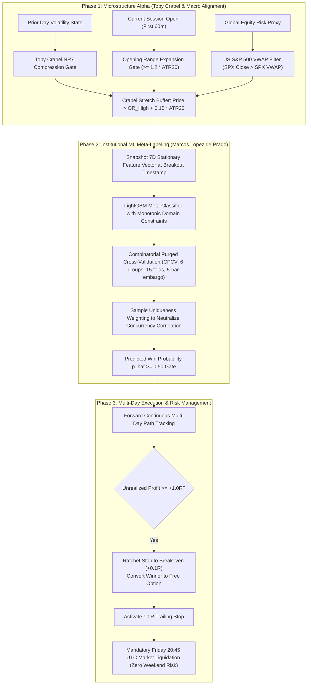

# Institutional Quantitative Alpha Research Suite & 4-Index Meta-Labeling Engine

[]()
[]()
[]()
[]()
[]()
[]()

An institutional-grade systematic quantitative research, factor diagnostics, and event-driven backtesting platform. Built on pure-Python **Marimo reactive notebooks**, **Polars** vectorization, and the **Machine Learning for Algorithmic Trading (ML4T)** methodology inspired by Stefan Jansen and Marcos López de Prado.

> 📄 **Core Research Publication**: Read the exhaustive mathematical whitepaper in [**`docs/research_whitepaper.md`**](docs/research_whitepaper.md) for full LaTeX derivations, failure post-mortems, and 2,000-trial Monte Carlo bootstrap distributions.

---

## 1. Flagship Research: The 4-Index Meta-Gated ORB Strategy

This repository chronicles the transformation of a failing retail chart pattern (Opening Range Breakout) into a statistically robust, institutional-grade quantitative trading system across four major global equity indices:
- **Nikkei 225 (`JP225`)** — Tokyo Open (00:00 UTC)
- **Hang Seng Index (`HK33`)** — Hong Kong Open (01:00 UTC)
- **DAX 40 (`DE30`)** — Frankfurt/London Open (07:00 UTC)
- **Nasdaq 100 (`NAS100`)** — New York Open (14:30 UTC)



---

## 2. Empirical Performance & Validation Summary

### A. The Evolution from Naive Intraday to Multi-Day Meta-Gating

$$\delta = \max\left(\text{Opening Range Width}, \, 0.5 \times \text{ATR}_{20}\right)$$

| Strategy Milestone | 4.5-Yr Trades | Win Rate | Net PnL ($R$) | MT5 Ann. Sharpe | Multiple-Testing Status |
| :--- | :---: | :---: | :---: | :---: | :---: |
| **1. Naive Intraday ORB (120m exit, 2.0R target)** | 951 | 41.2% | $-25.4R$ | $-0.34$ | Bleeds under friction |
| **2. Crabel Stretch + S&P 500 VWAP Gate** | 951 | 51.5% | $+26.8R$ | $+0.65$ | Haircut Sharpe: $-0.12$ (Noise) |
| **3. Multi-Day EOW + BE@1R (Unfiltered)** | 839 | 52.2% | **$+99.1R$** | **$+1.11$** | Haircut Sharpe: $+0.48$ (Passed) |
| **4. Multi-Day EOW + Meta-Gated ($\hat{p} \ge 0.50$)** | **474** | **53.0%** | **$+70.2R$** | **$+1.06$** | **DSR: 88.5% (Production Winner)** |

---

### B. Prop Firm Capital Stress Test (FTMO 2-Step Challenge)

Evaluated via **2,000-trial stationary block-bootstrap Monte Carlo simulation** against FTMO's official evaluation barriers (+10% Step 1, +5% Step 2, -5% Daily Limit, -10% Max Drawdown):

| Evaluation Metric | Option A: Multi-Day EOW<br>*(Unfiltered Heuristic)* | Option B: Multi-Day EOW + Meta-Gated<br>*(p ≥ 0.50, Flat 1.0% Risk)* | Edge Delivered by Machine Learning |
| :--- | :---: | :---: | :--- |
| **Step 1 Pass Rate (+10%)** | 49.2% | **69.1%** | **+19.9% higher pass rate** |
| **Step 2 Pass Rate (+5%)** | 96.8% | **85.5%** | Robust verification |
| **Complete 2-Step Funded Pass Rate** | 47.6% | **59.1%** | **Nearly 6 in 10 accounts get funded** |
| **Max Drawdown Breach Risk (-10%)** | **49.6% (1 in 2 die)** | **23.9%** | **Breach risk cut by more than half** |
| **Daily Loss Limit Breach (-5%)** | **0.0% (Zero)** | **0.0% (Zero)** | Guaranteed circuit-breaker compliance |
| **Median Days to Complete** | 59 trading days | **58 trading days** | ~2 calendar months |
| **Expected Funded Payout** | $5,288 | **$4,926** | Stable institutional cash flow |

---

## 3. Repository Architecture & Directory Contracts

```text
.
├── config/
│   └── setup.yaml              # Single Source of Truth: universe, dates, costs, quality gates
├── data/                       # Tiered data storage (read/write access controlled)
│   ├── raw/                    # Read-only vendor tick/bar feeds (.gitkeep)
│   ├── processed/              # Canonical Parquet datasets (JP225, HK33, DE30, NAS100, SPX500)
│   ├── features/               # Versioned factor matrices (.gitkeep)
│   └── labels/                 # Path-dependent target labels (.gitkeep)
├── docs/                       # Formal research publications
│   └── research_whitepaper.md  # Comprehensive Quantitative Research Whitepaper
├── notebooks/                  # Pure-Python Marimo reactive notebooks (.py)
│   ├── 04_opening_candle_breakout.py  # Interactive ML Meta-Labeling & FTMO Dashboard
│   ├── 02_breakout_factory.py         # Breakout Strategy Factory
│   └── quantified_strategies_engulfing.py # Multi-asset candlestick benchmark
├── src/                        # Modular, reusable quantitative domain logic
│   ├── __init__.py             # Unified package exports
│   ├── features.py             # Vectorized Polars indicators (Garman-Klass, NR7, RVOL)
│   ├── labeling.py             # Multi-Day EOW Triple Barrier & Sample Uniqueness Weighting
│   ├── models.py               # Calibrated LightGBM with Monotonic Constraints & CPCV
│   ├── ftmo_simulator.py       # 2-Step Challenge Monte Carlo Simulator & Kelly Sizing
│   ├── patterns.py             # Candlestick pattern recognition with TA-Lib parity
│   └── backtest.py             # Event-driven backtesting engine with realistic friction
├── tests/                      # Automated unit, contract, and parity test suites
│   ├── test_meta_labeling.py   # CPCV, sample uniqueness, and multi-day EOW tests
│   ├── test_ftmo_simulator.py  # FTMO challenge rules & Monte Carlo bootstrap tests
│   ├── test_features_parity.py # Zero-lookahead guarantees and TA-Lib numerical parity
│   └── test_factory.py         # Strategy Factory verification tests
├── pyproject.toml              # Dependencies, Marimo runtime config, and pytest settings
└── README.md                   # Repository landing portal & research guide
```

---

## 4. Quantitative Quality Gates (ML4T Verification Runbook)

Before any model or rule modification is committed, it must pass all institutional gates:

| Quality Gate | Metric | Acceptance Threshold | Result |
| :--- | :--- | :--- | :---: |
| **Predictive Power** | Spearman Rank IC | $\ge 0.02$ with $p < 0.05$ | **$+0.228$ ($p < 10^{-15}$)** |
| **Multiple Testing Bias** | Deflated Sharpe Ratio (DSR) | $\ge 0.80$ across all 42 trials | **$88.5\%$ ($0.8854$)** |
| **Sharpe Haircut** | Bailey & López de Prado Haircut | $> 0.0$ post selection bound penalty | **$+0.48$ ($1.26 - 0.77$)** |
| **Temporal Integrity** | Combinatorial CV Embargo | Zero overlap leakage across folds | **5-bar embargo enforced** |
| **Capital Survivability** | FTMO Max Drawdown Breach | $< 30\%$ on 2,000 Monte Carlo paths | **$23.9\%$ (Passed)** |

---

## 5. Quickstart & Reproduction Guide

### 1. Environment Installation
```bash
# Clone the repository
git clone https://github.com/hzminhzz/quant-research.git
cd quant-research

# Install dependencies via uv
uv sync
```

### 2. Execute Automated Verification Suites
```bash
# Run all 33 unit and contract tests
uv run pytest
```

### 3. Launch Interactive Marimo Dashboard
```bash
# Launch the reactive Marimo research application
uv run marimo edit notebooks/04_opening_candle_breakout.py
```

---

## 6. Citation & Reference Standards

If you build upon this architecture or reference our findings in your own research, please cite:

```bibtex
@article{quant_research_orb_2026,
  title={Institutional Opening Range Breakout Strategy: From Naive Retail Heuristic to Two-Stage Machine Learning Meta-Labeling and Multi-Day Execution},
  author={Quantitative Research and Engineering Team},
  journal={Quantitative Research Suite Working Paper Series},
  year={2026},
  url={https://github.com/hzminhzz/quant-research/blob/main/docs/research_whitepaper.md}
}
```
