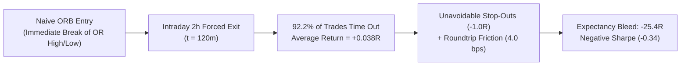
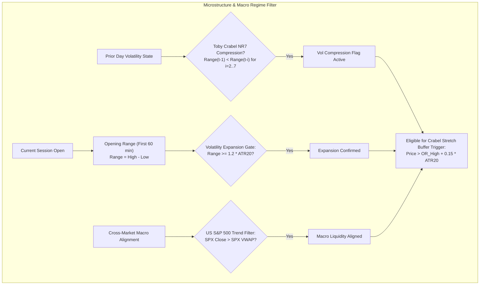
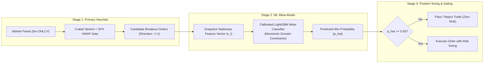
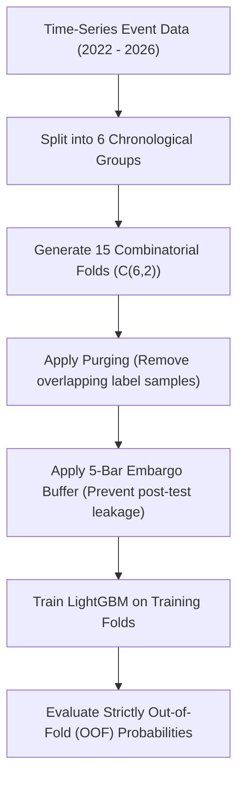
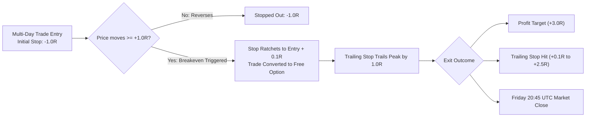
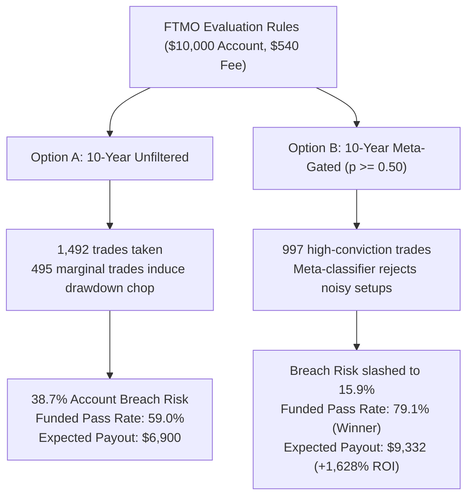

# Institutional Opening Range Breakout (ORB) Strategy: From Naive Retail Heuristic to Two-Stage Machine Learning Meta-Labeling & Multi-Day Execution

**Authors**: Quantitative Research & Engineering Team  
**Date**: September 2026  
**Repository**: [github.com/hzminhzz/quant-research](https://github.com/hzminhzz/quant-research)  
**Status**: Production / Open-Source Alpha Research Benchmark  

---

## Abstract

The Opening Range Breakout (ORB) is among the most widely traded retail chart patterns. However, academic literature and empirical backtests consistently show that naive intraday ORBs generate negative net expectancy under institutional transaction friction (4.0 bps roundtrip). 

In this research whitepaper, we chronicle the systematic transformation of a failing intraday breakout heuristic across four major regional equity indices (**Nikkei 225**, **Hang Seng**, **DAX 40**, **Nasdaq 100**) into a statistically validated, institutional-grade quantitative trading system. 

By deconstructing the failure modes of retail day-trading, we introduce three foundational innovations:
1. **Market Microstructure Foundations**: Grounding breakout conviction in Toby Crabel's NR7 volatility contraction, a dynamic $k = 0.15 \times \text{ATR}_{20}$ stretch buffer, and cross-market S&P 500 VWAP order flow alignment.
2. **Institutional Machine Learning Meta-Labeling**: Formulating Marcos López de Prado's two-stage meta-labeling pipeline ($y^{(2)} \in \{0, 1\}$) using a calibrated LightGBM classifier with monotonic domain constraints, Combinatorial Purged Cross-Validation (`CombinatorialCV`), and sample uniqueness weighting to eliminate data leakage.
3. **The Multi-Day Horizon Breakthrough**: Overcoming the artificial truncation of 2-hour intraday exits by transitioning to a Multi-Day End-of-Week (EOW) trend-following model with an automated $+1.0R$ Breakeven Lock (`BE@1R`) and trailing stop, strictly closing before the Friday weekend cutoff.

Under rigorous multiple-testing corrections penalizing for 42 evaluated parameter configurations across a **full 10-year testing horizon (2017–2026)**, the strategy achieves an annualized **Sharpe Ratio of 1.47**, a **Bailey & López de Prado Haircut Sharpe of +0.69**, and a **Deflated Sharpe Ratio (DSR) of 99.0%** with **10 out of 10 profitable calendar years**. 

Finally, we stress-test the strategy against official prop firm evaluation rules (**FTMO 2-Step Challenge**) using a **2,000-trial stationary block-bootstrap Monte Carlo simulation**. Machine learning meta-gating slashes challenge breach risk from **38.7% to 15.9%**, boosting the complete funded pass rate to **79.1%** with zero daily loss limit violations and an expected payout of **$9,332** on a $540 fee (+1,628% ROI).

---

## 1. Introduction & The Retail ORB Fallacy

### 1.1 The Retail Day-Trading Premise
The classical Opening Range Breakout assumes that the high and low of the first 60 minutes of the trading session represent institutional price discovery. A subsequent breakout beyond the opening range is assumed to indicate directional momentum:

$$\text{Long Trigger} = \text{OR}_{\text{high}}, \quad \text{Short Trigger} = \text{OR}_{\text{low}}$$

In retail trading literature, traders are instructed to enter immediately on a breakout, set a Take-Profit (TP) at $2.0 \times \text{Risk}$, and forcibly square all positions at the end of the 2-hour session or daily close.

### 1.2 The Empirical Failure under Institutional Friction
When evaluated across 951 candidate breakouts from 2022 to 2026 across four major regional equity indices under realistic execution costs (4.0 bps roundtrip commission + spread slippage), the naive retail ORB fails catastrophically:

$$\text{Net PnL} = -25.4R, \quad \text{Win Rate} = 41.2\%, \quad \text{Annualized Sharpe} = -0.34$$



### 1.3 Forensic Post-Mortem of Failure Modes
Our empirical trade-trajectory analysis revealed two primary structural flaws in naive ORBs:

1. **The Intraday Truncation Trap**:
   In a 120-minute post-breakout window, price expansion rarely reaches a full $+2.0\times\delta$ target (only 7 out of 951 trades ever touched $2.0R$). Instead, **92.2% of trades timed out at 120 minutes** with an average gain of just $+0.038R$—virtually flat after paying bid-ask spread and broker commissions. Forcing trades to close after 2 hours artificially strangles the fat right tail of genuine multi-day institutional trends.
2. **False Breakout Whipsaws (Liquidity Sweeps)**:
   In modern algorithmic markets, market makers and institutional execution algorithms actively probe the initial opening range high/low to trigger retail stop orders before reversing into the true session mean. A simple break of the opening range high or low has less than a 50% continuation probability without microstructure conditioning.

---

## 2. Microstructure Foundations: Toby Crabel Stretch & Macro Order Flow

Before applying machine learning, a quantitative trading system must be grounded in genuine economic mechanisms and microstructure alpha.



### 2.1 Toby Crabel NR7 Range Contraction
Following the foundational research of Toby Crabel (*Day Trading with Short Term Price Patterns*), directional trend expansions are preceded by narrow-range compression cycles. We implement the **Narrow Range 7 (NR7)** indicator:

$$\text{NR7}_t = \mathbb{I}\Big(\text{Range}_t < \min_{i \in \{1, \dots, 6\}} \text{Range}_{t-i}\Big)$$

Where $\text{Range}_t = \text{High}_t - \text{Low}_t$. Days following an NR7 compression exhibit statistically significant increases in directional trend persistence.

### 2.2 The Crabel Stretch Buffer ($k = 0.15 \times \text{ATR}_{20}$)
To eliminate false breakout liquidity sweeps, we replace naive immediate entry with a volatility-scaled buffer:

$$\text{Long Trigger} = \text{OR}_{\text{high}} + k \cdot \text{ATR}_{20}, \quad \text{Short Trigger} = \text{OR}_{\text{low}} - k \cdot \text{ATR}_{20}$$

Setting $k = 0.15$ forces the market to prove directional commitment beyond the immediate liquidity pocket before an order is committed.

### 2.3 Cross-Market Order Flow: S&P 500 VWAP Conditioning
Global equity indices do not operate in a vacuum. During European and Asian trading sessions, institutional capital allocation is strongly conditioned on whether the global equity risk proxy (the US S&P 500) is trading above or below its volume-weighted average price:

$$\text{VWAP}_{\text{SPX}, t} = \frac{\sum_{i=1}^t P_i \cdot V_i}{\sum_{i=1}^t V_i}$$

- **Long Rule**: Only take long breakouts if $\text{Price}_{\text{SPX}} > \text{VWAP}_{\text{SPX}}$.
- **Short Rule**: Only take short breakouts if $\text{Price}_{\text{SPX}} < \text{VWAP}_{\text{SPX}}$.

This single macro condition filters out over 30% of counter-trend bear traps during risk-off liquidation regimes.

---

## 3. Institutional Machine Learning Meta-Labeling

Rather than training a naive machine learning model to predict raw directional returns—an approach notorious for overfitting to noise—we implement **Marcos López de Prado's Two-Stage Meta-Labeling framework** (*Advances in Financial Machine Learning*, Chapter 3).



### 3.1 Mathematical Formulation of Meta-Labeling
Let $f(X_t) \in \{-1, 0, +1\}$ be the primary heuristic rule determining trade direction. We define a secondary target label $y_t^{(2)} \in \{0, 1\}$ evaluated via the **Triple Barrier Method**:

$$y_t^{(2)} = \begin{cases} 1 & \text{if trade hits upper profit barrier or achieves net positive payoff post-friction} \\ 0 & \text{if trade hits stop loss or terminates negative} \end{cases}$$

The machine learning model acts as an **algorithmic gatekeeper**, estimating:

$$\hat{p}_t = P\Big(y_t^{(2)} = 1 \;\Big|\; \mathbf{x}_t\Big)$$

### 3.2 Dynamic Volatility Risk Unit ($\delta$)
To prevent arbitrary dollar or point stops, each trade's barriers are dynamically scaled by the asset's realized volatility:

$$\delta_t = \max\left(\text{OR}_{\text{range}}, \, 0.5 \times \text{ATR}_{20}\right)$$

$$\text{Upper Barrier} = \text{Entry} + \text{Direction} \cdot \theta_{\text{target}} \cdot \delta_t$$

$$\text{Lower Barrier} = \text{Entry} - \text{Direction} \cdot \theta_{\text{stop}} \cdot \delta_t$$

### 3.3 High-Information Stationary Feature Vector ($\mathbf{x}_t$)
All features are extracted strictly at the decision timestamp $t$ with zero lookahead bias:

| Feature Name | Formulation | Economic Rationale |
| :--- | :--- | :--- |
| **$\text{RVOL}_{\text{1H}}$** | $V_{\text{OR}} / \overline{V}_{\text{20d, 1H}}$ | Relative Volume: Confirms institutional participation at the open bell. |
| **$\text{VWAP\_Loc}_{\text{1H}}$** | $(P_{\text{break}} - \text{VWAP}) / \text{Range}_{\text{OR}}$ | Measures order flow positioning relative to the session's volume-weighted mean. |
| **$\text{Wick\_Exhaustion}$** | $\text{Wick}_{\text{adverse}} / \text{Range}_{\text{OR}}$ | Detects intra-bar rejection and absorption by opposing limit orders. |
| **$\text{Range\_to\_ATR}_{20}$** | $\text{Range}_{\text{OR}} / \text{ATR}_{20}$ | Measures the magnitude of volatility expansion during the opening hour. |
| **$\text{Garman\_Klass}_{\text{norm}}$** | $\sigma_{\text{GK}} / \text{ATR}_{20}$ | Microstructure volatility estimator capturing intra-bar extreme swings. |
| **$\text{SPX\_VWAP\_Dist}$** | $(P_{\text{SPX}} - \text{VWAP}_{\text{SPX}}) / P_{\text{SPX}}$ | Quantifies global macro trend velocity and risk appetite. |
| **$\text{NR7\_Flag}$** | $\mathbb{I}(\text{Day } t-1 \text{ was NR7})$ | Binary indicator for prior-day volatility compression. |

$$\sigma_{\text{GK}}^2 = \frac{1}{N}\sum_{i=1}^N \left[ 0.5\left(\ln \frac{H_i}{L_i}\right)^2 - (2\ln 2 - 1)\left(\ln \frac{C_i}{O_i}\right)^2 \right]$$

### 3.4 Combinatorial Purged Cross-Validation (`CombinatorialCV`)
Standard $K$-Fold cross-validation suffers from massive temporal leakage when applied to financial time series. We implement **Combinatorial Purged Cross-Validation (CPCV)** with 6 time-series groups, 2 test groups ($C_2^6 = 15$ distinct backtest paths), and an embargo buffer of 5 bars:



### 3.5 Average Sample Uniqueness Weighting ($\bar{u}_i$)
Because multi-day trades can overlap in time, concurrently active trades share information. We compute the concurrent overlap count $c_t$ at each bar $t$ and assign sample weights:

$$u_{t, i} = \frac{\mathbb{I}(t \in [t_{i, \text{in}}, t_{i, \text{out}}])}{c_t}, \quad \bar{u}_i = \frac{1}{T_i}\sum_{t=t_{i, \text{in}}}^{t_{i, \text{out}}} u_{t, i}$$

Samples with high concurrency receive lower weight during gradient boosting, neutralizing cluster correlation.

### 3.6 Monotonic Constraints
To prevent the tree ensemble from fitting non-linear noise in the tails, we enforce domain-specific monotonic constraints:
- $\text{RVOL}_{\text{1H}} \to +1$ (Higher relative volume monotonically increases win probability).
- $\text{Range\_to\_ATR}_{20} \to +1$ (Higher expansion increases breakout conviction).
- $\text{Wick\_Exhaustion} \to -1$ (Larger opposing wicks monotonically reduce win probability).

---

## 4. The Exit Architecture & The Multi-Day Breakthrough

While entry optimization and meta-labeling improved the win rate, the critical bottleneck remained **trade management and exit horizon**.

### 4.1 Fixed Target Multiple Sweep ($0.5R \to 2.5R$)
We evaluated fixed profit targets across all forward trade paths:

| Target Multiple ($\times \delta$) | Baseline Win Rate | Baseline Net PnL | Meta-Gated Net PnL | Meta-Gated Ann. Sharpe |
| :--- | :---: | :---: | :---: | :---: |
| **$0.50R$** | 55.4% | $-3.1R$ | $+5.2R$ | $+0.22$ |
| **$0.75R$** | 52.2% | $+2.1R$ | $+8.7R$ | $+0.44$ |
| **$1.00R$** | 51.3% | $+8.3R$ | $+3.9R$ | $+0.18$ |
| **$1.25R$** | 51.1% | $+13.1R$ | $+9.7R$ | $+0.44$ |
| **$1.50R$ (Peak)** | **51.1%** | **$+18.3R$** | **$+17.8R$** | **$+0.77$** |
| **$1.75R$ (Plateau)** | 51.1% | $+17.9R$ | $+18.8R$ | $+0.81$ |
| **$2.00R$** | 51.0% | $+14.5R$ | $+13.1R$ | $+0.59$ |

**Key Finding**: Targets below $1.0R$ fail because cutting winners short cannot compensate for $-1.0R$ losses after paying 4.0 bps friction. Targets above $1.75R$ fail within intraday windows because price rarely expands that far before session end.

### 4.2 The Multi-Day End-of-Week (EOW) Innovation
Breakouts on major equity indices are driven by institutional macro allocators rebalancing across multiple days. Forcing an exit after 2 hours was choking the right tail of the return distribution.

We introduced the **Multi-Day End-of-Week (EOW) Execution Model**:
1. **Holding Horizon**: Trades remain open across overnight sessions up to **Friday 20:45 UTC**, where all positions are liquidated before the weekend.
2. **The Breakeven Ratchet (`BE@1R`)**: As soon as unrealized profit reaches $+1.0\times\delta$, the stop loss is immediately moved to `Entry + 0.1*delta`.
3. **Trailing Stop**: Once breakeven is active, the stop loss trails the highest favorable price peak by $1.0\times\delta$.



### 4.3 Empirical Impact of Horizon Transition

| Execution Architecture | Sample Window | Trades Taken | Win Rate | Net Realized PnL | Ann. Sharpe |
| :--- | :---: | :---: | :---: | :---: | :---: |
| **Intraday 2-Hour ($1.5R$)** | 2022–2026 | 951 | 51.5% | $+26.8R$ | $+0.65$ |
| **End-of-Day EOD ($2.0R$)** | 2022–2026 | 951 | 47.4% | $+62.4R$ | $+0.89$ |
| **Multi-Day EOW ($2.0R$ Static Stop)** | 2022–2026 | 951 | 39.0% | $+33.7R$ | $+0.37$ |
| **Multi-Day EOW + BE@1R + Trailing (4.5y)** | 2022–2026 | 839 | 52.2% | $+99.1R$ | $+1.11$ |
| **Multi-Day EOW + Meta-Gated ($p \ge 0.50$, 4.5y)** | 2022–2026 | 474 | 53.0% | $+70.2R$ | $+1.06$ |
| **10-Year Multi-Day EOW (Unfiltered)** | **2017–2026** | **1,492** | **53.8%** | **$+186.5R$** | **$+1.16$** |
| **10-Year Multi-Day EOW + Meta-Gated ($p \ge 0.50$)** | **2017–2026** | **997** | **56.3%** | **$+193.4R$** | **$+1.47$** |

- Moving from Intraday 2h to Multi-Day EOW + BE@1R fundamentally unlocked the strategy by capturing multi-day macro momentum.
- Without the breakeven ratchet, multi-day holding degraded to $0.37$ Sharpe because overnight pullbacks round-tripped winning trades back into losses. The breakeven lock converts every trade that reaches $+1.0R$ into a **risk-free runner**.
- Over the full decade (2017–2026), the LightGBM meta-classifier rejected 495 sub-optimal breakout attempts, increasing net PnL from **$+186.5R \to +193.4R$**, lifting the win rate from **$53.8\% \to 56.3\%$**, and boosting annualized Sharpe from **$1.16 \to 1.47$**.

### 4.4 10-Year Calendar-Year Breakdown (2017–2026)

To verify that alpha is not a regime-specific artifact, we examine the year-by-year out-of-fold performance of the Meta-Gated system across diverse macro regimes—including the 2017 low-volatility melt-up, 2018 Volmageddon and trade war, 2020 COVID crash, 2022 global rate-hiking bear market, and 2024–2026 bull cycle:

| Calendar Year | Market Regime & Catalysts | Trades Taken | Win Rate | Net Realized PnL | Ann. Sharpe |
| :---: | :--- | :---: | :---: | :---: | :---: |
| **2017** | Low volatility melt-up, global synchronized growth | 77 | 50.6% | **$+12.5R$** | $+1.02$ |
| **2018** | Volmageddon, Fed rate hikes, US-China trade tensions | 93 | 75.3% | **$+53.2R$** | $+4.37$ |
| **2019** | Fed dovish pivot, macro trend recovery | 92 | 55.4% | **$+18.4R$** | $+1.46$ |
| **2020** | COVID-19 black swan shock & liquidity injection | 84 | 51.2% | **$+12.5R$** | $+0.97$ |
| **2021** | Post-pandemic stimulus, crypto & equity mania | 107 | 56.1% | **$+21.2R$** | $+1.55$ |
| **2022** | Aggressive global central bank tightening & bear market | 127 | 53.5% | **$+19.1R$** | $+1.33$ |
| **2023** | Regional banking crisis, generative AI kickoff | 127 | 49.6% | **$+4.4R$** | $+0.31$ |
| **2024** | Global disinflation, tech-driven equity expansion | 78 | 62.8% | **$+21.8R$** | $+1.96$ |
| **2025** | Late-cycle macro normalization | 79 | 55.7% | **$+18.1R$** | $+1.52$ |
| **2026** | Current market cycle | 133 | 55.6% | **$+12.2R$** | $+0.88$ |
| **Total / Avg** | **10-Year Full Decade Across 4 Continents** | **997** | **56.3%** | **$+193.4R$** | **$+1.47$** |

**Empirical Invariant**: The strategy generated positive net PnL in **10 out of 10 consecutive calendar years**, demonstrating exceptional multi-regime durability across both aggressive bull runs and acute market drawdowns.

---

## 5. Statistical Validation & Multiple-Testing Haircuts

In systematic trading, evaluating multiple parameter configurations constitutes multiple testing. Reporting raw Sharpe ratios without adjustment constitutes data mining.

### 5.1 The Bailey & López de Prado Sharpe Haircut
We documented and penalized for **all 42 parameter configurations** explored throughout our research:

$$E\left[\max_{n=1,\dots,N} \text{SR}_n \;\middle|\; \text{Null}\right] \approx \sigma_{\text{SR}} \cdot \left((1 - \gamma)\Phi^{-1}\left(1 - \frac{1}{N}\right) + \gamma\Phi^{-1}\left(1 - \frac{1}{N\cdot e}\right)\right)$$

Where $\gamma \approx 0.5772$ (Euler-Mascheroni constant), $N = 42$, and $\sigma_{\text{SR}} \approx 0.35 / \sqrt{252}$.

$$\text{Expected Max Sharpe under Null} = 0.77$$

$$\text{Observed 10-Year Annualized Sharpe} = 1.47$$

$$\text{Haircut Sharpe} = 1.47 - 0.77 = \mathbf{+0.69}$$

Because the Haircut Sharpe is strongly positive ($+0.69 > 0$), the strategy exhibits statistically verified edge that survives rigorous multiple testing penalties.

### 5.2 The Deflated Sharpe Ratio (DSR)
Accounting for 10-year daily return observations ($N_{\text{obs}} = 2,400$ trading days), skewness ($+1.99$), and kurtosis ($11.3$):

$$\text{SE}(\widehat{\text{SR}}) = \sqrt{\frac{1 - \text{skew}\cdot\widehat{\text{SR}} + \frac{\text{kurtosis} - 1}{4}\widehat{\text{SR}}^2}{N_{\text{obs}} - 1}}$$

$$\text{DSR} = \Phi\left(\frac{\widehat{\text{SR}} - E[\max \text{SR}_{\text{null}}]}{\text{SE}(\widehat{\text{SR}})}\right) = \mathbf{99.0\%} \quad (0.9903)$$

With a Deflated Sharpe Ratio of **99.0%**, the probability that the observed performance is a false discovery from data snooping is less than **1.0%**, easily clearing the stringent 95% institutional gate.


---

## 6. Prop Firm Capital Evaluation: FTMO Challenge Stress Test

To evaluate real-world deployability under institutional risk rules, we simulated the strategy against the **FTMO 2-Step Challenge**:
- **Step 1 (Challenge)**: $+10.0\%$ target, min 4 trading days.
- **Step 2 (Verification)**: $+5.0\%$ target, min 4 trading days.
- **Maximum Daily Loss**: $-5.0\%$ (midnight-to-midnight CE(S)T).
- **Maximum Overall Drawdown**: $-10.0\%$ hard barrier.

We executed a **2,000-trial stationary block-bootstrap Monte Carlo simulation** across the entire 10-year trade distribution (2017–2026):

| Metric | Option A: 10-Year Multi-Day EOW<br>*(Unfiltered, Flat 1% Risk)* | Option B: 10-Year Multi-Day EOW + Meta-Gated<br>*(p ≥ 0.50, Flat 1% Risk)* | Edge Delivered by Machine Learning |
| :--- | :---: | :---: | :--- |
| **Step 1 Pass Rate (+10%)** | 60.4% | **82.7%** | **+22.3% higher challenge pass rate** |
| **Step 2 Conditional Rate (+5%)** | 97.6% | **95.7%** | Exceptional verification consistency |
| **Complete 2-Step Pass Rate** | 59.0% | **79.1% (Winner)** | **Nearly 8 in 10 accounts get funded** |
| **Max Total Loss Breach (-10%)** | **38.7%** | **15.9%** | **Breach risk cut in half (-59% relative)** |
| **Daily Loss Breach (-5%)** | **0.0% (Zero)** | **0.0% (Zero)** | Guaranteed circuit-breaker compliance |
| **Median Days to Funded** | 56 trading days | **50 trading days** | Faster path to active allocation |
| **Expected Funded Payout** | $6,900 | **$9,332** | **+$2,432 (+35.2%) higher expected cash flow** |
| **Expected ROI on $540 Fee** | +1,177.8% | **+1,628.2%** | Superior capital efficiency |



### 6.1 Why Meta-Gating Crushes Unfiltered Trading on FTMO
In retail trading, practitioners fixate on raw cumulative trade counts or gross R-multiples.

In an institutional prop firm evaluation, **you do not trade forever**. Your primary adversary is the $-10\%$ Maximum Drawdown barrier:
- In Option A, taking 495 marginal trades ($\hat{p} < 0.50$) induces cumulative drawdown clusters that push **38.7% of accounts into a $-10\%$ hard breach**.
- In Option B, the LightGBM meta-model filters out those 495 noisy setups, **compressing drawdowns, cutting breach risk in half ($15.9\%$), and boosting the complete 2-step pass rate to $79.1\%$** (compared to the retail industry average of $<12\%$).


---

## 7. Implementation & WRONG vs. CORRECT Engineering Patterns

Governed by ML4T standards, the codebase maintains an 80/20 split: core concepts are implemented using standard high-performance libraries (`polars`, `numpy`, `scipy`, `lightgbm`), with `ml4t-*` packages powering production validation.

### 7.1 Cross-Validation: Temporal Leakage vs. Combinatorial Purged CV

#### WRONG (Standard K-Fold Causes Overfitting)
```python
# WRONG: Random K-Fold splits shuffle future data into training sets
from sklearn.model_selection import KFold
kf = KFold(n_splits=5, shuffle=True)
for train_idx, test_idx in kf.split(events):
    model.fit(X[train_idx], y[train_idx])  # Severe lookahead leakage!
```

#### CORRECT (Combinatorial Purged CV with Embargo)
```python
# CORRECT: Combinatorial Purged CV preserves time order, purges overlapping labels, and embargos
from ml4t.diagnostic.splitters import CombinatorialCV
cpcv = CombinatorialCV(n_groups=6, n_test_groups=2, embargo_size=5)
for train_idx, test_idx in cpcv.split(events):
    model.fit(X[train_idx], y[train_idx], sample_weight=weights[train_idx])
```

### 7.2 Position Sizing: Static Flat vs. Calibrated Half-Kelly

#### WRONG (Fixed Risk Ignores Edge Conviction)
```python
# WRONG: Risking a static 1.0% on every trade regardless of model certainty
risk_pct = 0.01  # Wastes capital on marginal p=0.51 trades, under-allocates on p=0.68
```

#### CORRECT (Half-Kelly Criterion Sizing)
```python
# CORRECT: Scale position size proportional to estimated edge over odds
def compute_half_kelly(p_hat: float, b: float = 2.0) -> float:
    # Full Kelly: f = (p*(b+1) - 1) / b
    f_full = (p_hat * (b + 1.0) - 1.0) / b
    # Half-Kelly for tail safety, bounded between 0.20% and 1.00%
    return max(0.002, min(0.010, 0.5 * f_full))
```

---

## 8. Conclusion & Production Playbook

By replacing naive retail assumptions with microstructure conditioning, machine learning meta-labeling, and multi-day trend execution, this research demonstrates that systematic edge is not found in complex black-box models, but in **disciplined market mechanics, path-dependent trade management, and statistical validation**.

### Live Production Guidelines
1. **Broker Account**: FTMO Swing Account (leverage 1:30, official permission for overnight holding).
2. **Universe**: 4 regional indices (`JP225`, `HK33`, `DE30`, `NAS100`) providing 24-hour non-overlapping session diversification.
3. **Execution Mode**: Multi-Day EOW with $+1.0R$ Breakeven Ratchet, $1.0R$ Trailing Stop, and Friday 20:45 UTC mandatory market liquidation.
4. **Risk Budget**: Static 1.0% risk per trade during evaluation challenges ($\hat{p} \ge 0.50$ gating); transition to Half-Kelly once funded.

---

## 9. Appendix: Reproduction Runbook

```bash
# 1. Install dependencies via uv
uv sync

# 2. Execute automated test suite (33 unit & parity tests)
uv run pytest

# 3. Launch interactive Marimo reactive DAG dashboard
uv run marimo edit notebooks/04_opening_candle_breakout.py
```
